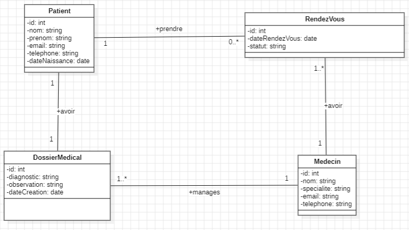
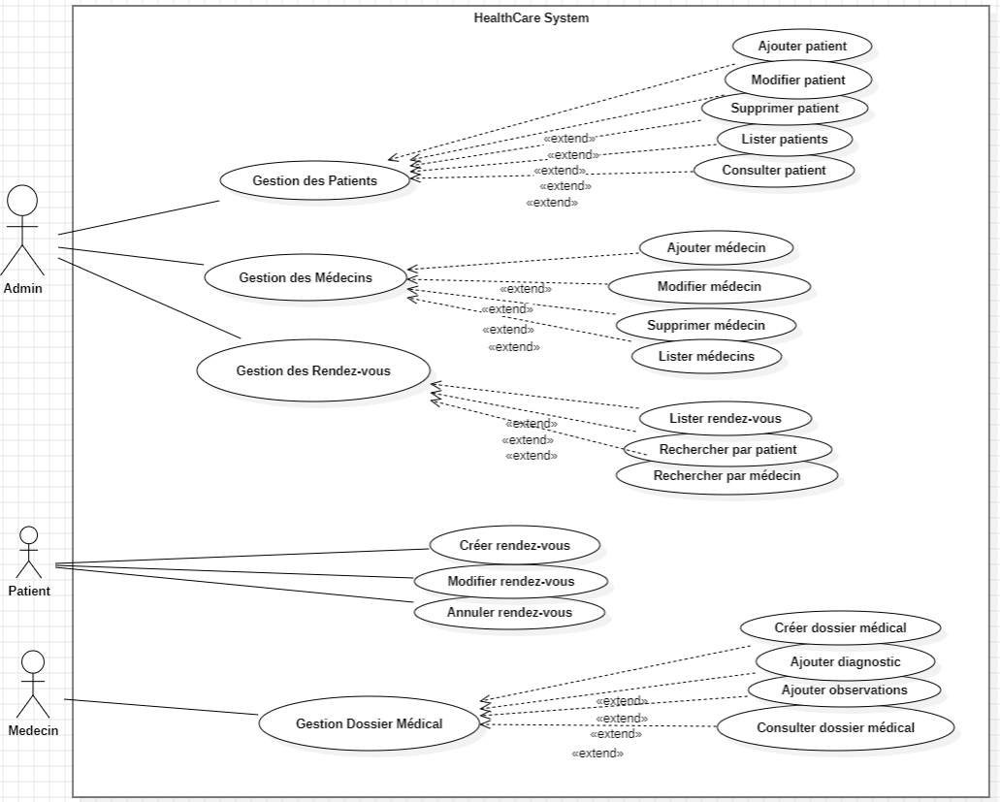

Application web Full-Stack permettant de gérer les patients, les médecins, les rendez-vous et les dossiers médicaux afin de simplifier la gestion des établissements de santé.

Diagramme de Classes : 

Diagramme de Cas d'Utilisation :

Diagramme de Séquence Ajouter Patient:

Diagramme de Séquence Rechercher Par Patient:

Diagramme de Séquence Rechercher Par Patient:

